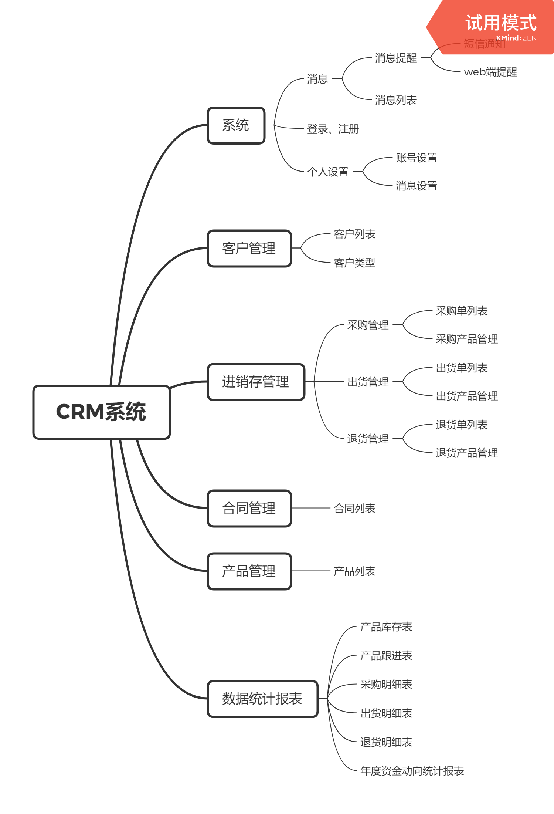

# CRM+ERP 客户仓促管理系统（计划文档） 
### @auther userqiao
1. 组织架构：
    + 后端：Spring Boot 2.3.0.RELEASE
    + 前端：Vue2(后期可能会优化为Vue3.0)

2. 背景：CRM系统，即客户关系管理系统，是指利用软件、硬件和网络技术，为企业建立一个客户信息收集、管理、分析和利用的信息系统。以客户数据的管理为核心，记录企业在市场营销和销售过程中和客户发生的各种交互行为，以及各类有关活动的状态，提供各类数据模型，为后期的分析和决策提供支持。

3. 大概功能 